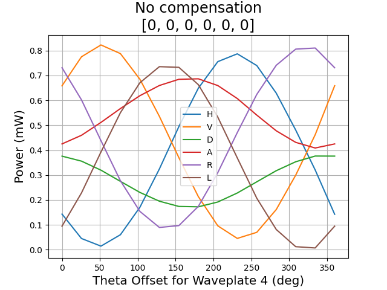
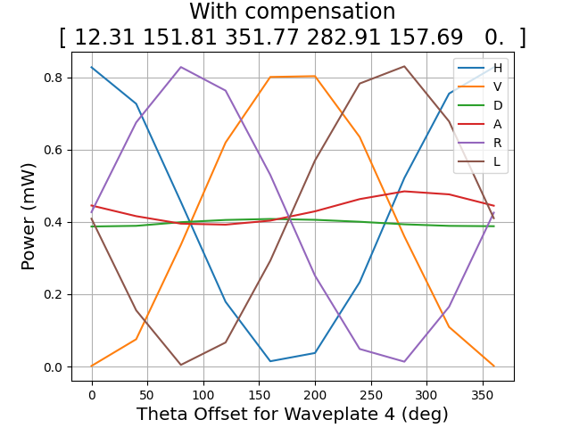

# Polarization reference frame alignment using the inverse-matrix method

a few scripts to calculate an unknown fiber rotation, as well as the retardance angles to set the polarization controller in order to reverse it.

## Setup

The Polarization Synthesizer creates the reference states (H and D). T is the fiber with the unknown transformation. We use the Nucrypt Polarization Analyzer (6 variable retarders) and a powermeter to perform a series of measurements in different bases. The server information for these 3 devices are stored in [serverinfo.yaml](serverinfo.yaml).

Inside the PA, there is a second fiber with unknown transformation F. We also solve for F in our least squares fitting. F doesn't change that much since it is inside the device. As of July 2025, F can be compensated with the last 3 variable retarders set around [280, 160, 0] (degrees).


## Usage
Creating a `Fiberized` object performs the alignment routine upon initialization.  
```python
from leastsquares_fiberized import Fiberized
from scipy.spatial.transform import Rotation as r

# Create a Fiberized object with 16 random rotations
A = Fiberized(rotation_list=r.random(16), verbose=False)
A.print_results()

# Plot the polarization fringes with compensation
A.plot_fringe(filepath='plots/withcompensation.png', verbose=False, num_points=15)

# Plot the polarization fringes without compensation
plot(title='No compensation\n[0, 0, 0, 0, 0, 0]', filepath='plots/nocompensation.png', verbose=True, num_points=15)
```

Sample output:
```text
Calculated T: 
 [[-0.88310004 -0.00944535 -0.46908965]
 [ 0.13319058  0.95361972 -0.26994388]
 [ 0.44988285 -0.30086577 -0.84088359]]
Calculated first row of F: 
 [ 0.23774342 -0.40017692 -0.88506299]
N_H, N_D:  0.8491590000000001 0.8545297461911898
Cost:  0.00034216531438878195
Retardance angles: 
 [ 12.30968684 151.80568097 351.77016781 282.90701227 157.69243608
   0.        ] 
 [199.27325956  24.95938699 357.47812842 254.4709117  335.65299484
   0.        ]
Total time taken (s):  11.17
Calculation time (s):  0.77
disconnected
disconnected
disconnected
```
<p align="center">
  
&nbsp; &nbsp; &nbsp; &nbsp;
  
</p>

## Code Organization
* **servoinfo.yaml** contains the host ip and port information of the 3 servers for the Nucrypt Polarization Analyzer (PA1000), Polarization Synthesizer (PSY201), and the powermeter (PM400).
* **leastsquares_fiberized.py** contains the `Fiberized` class, which performs the alignment upon initialization and computes the matrix T, the first row of F, and the retardance angles to set in order to compensate for these.
* **plot_fringe.py** contains plotting scripts for polarization correlation fringes
* **client.py** contains the `Client` class for interacting with the 3 servers.
* **measurements.py** contains a few functions for getting measurements for alignment and also plotting
* **nonideal.py** implements the Newton's method to find the retardance angles with nonideal axes for an arbitrary rotation matrix (outlined by the Nucrypt mathdoc). Also contains some useful functions to calculate the rotation matrix given retardance angles and axes of rotations.

