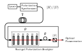
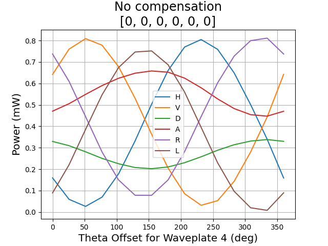
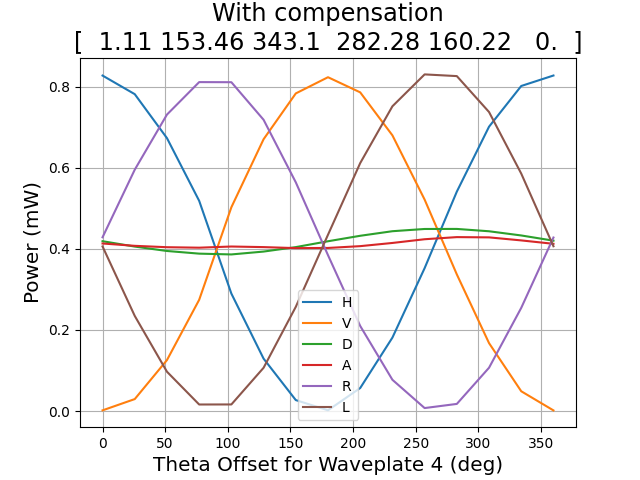

# Polarization reference frame alignment using the inverse-matrix method

a few scripts to calculate an unknown fiber rotation, as well as the retardance angles to set the polarization controller in order to reverse it.

## Setup

The Polarization Synthesizer creates the reference states (H and D). T is the fiber with the unknown transformation. We use the Nucrypt Polarization Analyzer (6 variable retarders) to perform a series of measurements in different bases.
Inside the PA, there is a second fiber with unknown transformation F. We also solve for F in our least squares fitting. F doesn't change that much since it is inside the device. As of July 2025, F can be compensated with the last 3 variable retarders set to around [280, 160, 0] (degrees).




## Usage

```python
from leastsquares_fiberized import Fiberized
from scipy.spatial.transform import Rotation as r

# Create a Fiberized object with 16 random rotations
# It performs the alignment upon initialization
A = Fiberized(rotation_list=r.random(16), verbose=False)
A.print_results()

# Plot the polarization fringes with compensation
A.plot_fringe(filepath='plots/withcompensation.png', verbose=False, num_points=15)

# Plot the polarization fringes without compensation
plot(title='No compensation\n[0, 0, 0, 0, 0, 0]', filepath='plots/nocompensation.png', verbose=True, num_points=15)
```

Sample output:
```text
Calculated T: 
 [[-0.8919294  -0.08238449 -0.44460628]
 [ 0.02132279  0.9745052  -0.2233494 ]
 [ 0.45167166 -0.20869214 -0.86743317]]
Calculated first row of F: 
 [ 0.23024226 -0.38612544 -0.89325005]
N_H, N_D:  0.8437189594026265 0.852531249534866
Cost:  0.0016725880514390761
Retardance angles: 
 [357.5693709  152.67964747 341.3817251  282.39477496 158.57110576
   0.        ] 
 [184.9934743   24.07161166   7.45227289 254.98314901 336.60805907
   0.        ]
Total time taken (s):  38.86
Calculation time (s):  1.52
disconnected
disconnected
disconnected
disconnected
disconnected
disconnected
```




## Code Organization
* **servoinfo.yaml** contains the host ip and port information of the 3 servers for the Nucrypt Polarization Analyzer (PA1000), Polarization Synthesizer (PSY201), and the powermeter (PM400).
* **leastsquares_fiberized.py** contains the `Fiberized` class, which performs the alignment upon initialization and computes the matrix T, the first row of F, and the retardance angles to set in order to compensate for these.
* **plot_fringe.py** contains plotting scripts for polarization correlation fringes
* **client.py** contains the `Client` class for interacting with the 3 servers.
* **measurements.py** contains a few functions for getting measurements for alignment and also plotting
* **nonideal.py** implements the Newton's method to find the retardance angles with nonideal axes for an arbitrary rotation matrix (outlined by the Nucrypt mathdoc). Also contains some useful functions to calculate the rotation matrix given retardance angles and axes of rotations.

